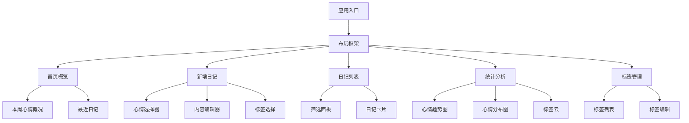
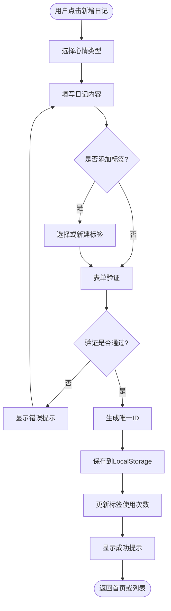
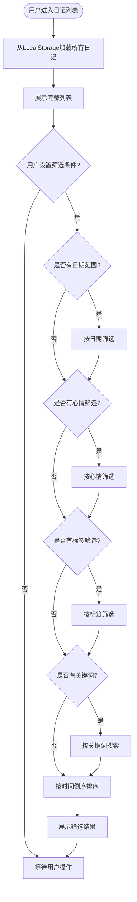
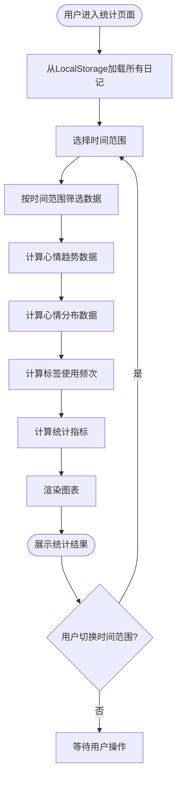

# 心情日记应用设计文档

## 1. 产品概述

### 1.1 应用定位
轻量级个人心情日记网页应用，帮助用户记录每日心情状态、撰写日记内容，并通过可视化统计了解自己的情绪变化趋势。

### 1.2 核心价值
- 便捷记录：快速记录当前心情和想法
- 情绪追踪：通过图表直观了解心情变化趋势
- 隐私保护：数据存储在本地浏览器，不上传服务器
- 回顾反思：支持按日期、心情、标签筛选历史记录

### 1.3 技术栈
基于现有记账本项目的技术架构：
- 前端框架：React 18.2 + Vite 5.0
- UI组件库：Ant Design 5.12
- 路由管理：React Router 6.20
- 图表渲染：Chart.js 4.4 + react-chartjs-2
- 日期处理：dayjs 1.11
- 状态管理：Context API
- 数据存储：浏览器 LocalStorage

## 2. 功能模块设计

### 2.1 功能架构



### 2.2 核心功能模块

#### 2.2.1 首页概览 (Home)
**功能职责**：展示用户心情状态概览和快速访问入口

**展示内容**：
- 今日心情卡片：显示今日是否已记录，快速新增入口
- 本周心情概况：以日历形式展示本周每日心情图标
- 最近日记：展示最近3-5条日记摘要
- 快捷操作：新增日记、查看统计按钮

**交互行为**：
- 点击日历日期：跳转到该日期的日记详情
- 点击日记摘要：查看日记完整内容
- 点击新增按钮：跳转到新增日记页面

#### 2.2.2 新增/编辑日记 (AddJournal)
**功能职责**：记录用户当前心情和日记内容

**输入项**：
- 日期时间：默认当前时间，可手动调整
- 心情选择：从预设心情列表中选择（必填）
- 日记标题：简短标题（选填，默认为"日期+心情"）
- 日记内容：富文本编辑器，支持多行文字（必填）
- 标签选择：多选标签，支持新建标签（选填）

**心情预设类型**（5级情绪模型）：
| 心情名称 | 图标标识 | 心情值 | 颜色主题 |
|---------|---------|-------|---------|
| 非常开心 | 😄 | 5 | 亮黄色 #FFD700 |
| 开心 | 🙂 | 4 | 浅绿色 #90EE90 |
| 平静 | 😐 | 3 | 浅蓝色 #87CEEB |
| 难过 | 😔 | 2 | 浅灰色 #B0B0B0 |
| 很难过 | 😢 | 1 | 深灰色 #696969 |

**表单验证规则**：
- 日期不能晚于当前时间
- 心情必须选择
- 日记内容不能为空且长度不超过5000字
- 标签名称长度不超过10字，最多选择5个标签

**操作行为**：
- 保存：验证通过后将数据存入LocalStorage
- 取消：返回上一页，未保存数据不保留
- 编辑模式：回显已有数据，保存时更新记录

#### 2.2.3 日记列表 (JournalList)
**功能职责**：展示历史日记记录并支持筛选和管理

**列表展示**：
- 按时间倒序（最近的在前）
- 每条日记卡片包含：
  - 日期时间
  - 心情图标和名称
  - 日记标题（或内容前30字）
  - 标签列表
  - 操作按钮：查看详情、编辑、删除

**筛选功能**：
- 日期范围筛选：支持选择开始和结束日期
- 心情类型筛选：多选心情类型
- 标签筛选：多选标签
- 关键词搜索：在标题和内容中搜索关键词

**批量操作**：
- 支持多选日记
- 批量删除
- 数据导出（JSON格式）

**交互行为**：
- 点击卡片：展开查看完整内容
- 下拉加载：分页加载历史记录（每页20条）
- 删除确认：弹窗二次确认避免误删

#### 2.2.4 统计分析 (Statistics)
**功能职责**：可视化展示用户心情数据的统计分析

**统计维度**：

**1. 心情趋势图（折线图）**
- X轴：日期（默认展示最近30天）
- Y轴：心情值（1-5分）
- 展示：每日心情变化曲线
- 支持：切换时间范围（7天/30天/90天/全部）

**2. 心情分布图（饼图）**
- 展示：各种心情出现的次数和占比
- 配色：与心情预设颜色对应
- 交互：点击扇区显示具体数量

**3. 标签云**
- 展示：使用频率最高的标签
- 字体大小：根据使用频次动态调整
- 交互：点击标签跳转到对应筛选结果

**4. 统计卡片**
- 记录总数
- 连续记录天数
- 最常出现的心情
- 本周平均心情值

**时间范围选择**：
- 本周
- 本月
- 最近30天
- 最近90天
- 全部时间
- 自定义范围

#### 2.2.5 标签管理 (Tags)
**功能职责**：管理用户自定义标签

**功能项**：
- 标签列表：展示所有标签及使用次数
- 新增标签：输入标签名称创建
- 编辑标签：修改标签名称
- 删除标签：删除标签（不影响已有日记中的标签）
- 标签搜索：按名称搜索标签

**预设标签**：
- 工作、学习、家庭、朋友、运动、娱乐、旅行、健康

**标签规则**：
- 标签名称唯一，不可重复
- 标签名称长度2-10字
- 删除标签时提示使用次数

## 3. 数据模型设计

### 3.1 日记记录数据结构

| 字段名称 | 字段类型 | 是否必填 | 说明 |
|---------|---------|---------|------|
| id | String | 是 | 唯一标识符（时间戳+随机数） |
| date | String | 是 | 日期时间（ISO 8601格式） |
| mood | Object | 是 | 心情对象（包含name、value、icon、color） |
| title | String | 否 | 日记标题 |
| content | String | 是 | 日记正文内容 |
| tags | Array<String> | 否 | 标签数组 |
| createdAt | String | 是 | 创建时间戳 |
| updatedAt | String | 是 | 最后更新时间戳 |

### 3.2 心情对象结构

| 字段名称 | 字段类型 | 说明 |
|---------|---------|------|
| name | String | 心情名称（如"开心"） |
| value | Number | 心情值（1-5） |
| icon | String | 心情图标（emoji） |
| color | String | 颜色代码（HEX格式） |

### 3.3 标签数据结构

| 字段名称 | 字段类型 | 是否必填 | 说明 |
|---------|---------|---------|------|
| id | String | 是 | 唯一标识符 |
| name | String | 是 | 标签名称 |
| count | Number | 是 | 使用次数（自动计算） |
| createdAt | String | 是 | 创建时间戳 |

### 3.4 LocalStorage存储键名

| 键名 | 用途 | 数据类型 |
|-----|------|---------|
| mood_journal_entries | 所有日记记录 | JSON Array |
| mood_journal_tags | 标签列表 | JSON Array |
| mood_journal_settings | 用户设置 | JSON Object |

## 4. 页面路由设计

### 4.1 路由表

| 路由路径 | 页面组件 | 页面说明 |
|---------|---------|---------|
| / | Home | 首页概览 |
| /add | AddJournal | 新增日记 |
| /edit/:id | AddJournal | 编辑日记（复用新增页面） |
| /journals | JournalList | 日记列表 |
| /journals/:id | JournalDetail | 日记详情 |
| /statistics | Statistics | 统计分析 |
| /tags | Tags | 标签管理 |

### 4.2 导航结构

底部导航栏（固定显示）：
- 首页（Home图标）
- 新增（加号图标，中央突出）
- 列表（列表图标）
- 统计（图表图标）
- 标签（标签图标）

## 5. 业务流程设计

### 5.1 新增日记流程



### 5.2 数据筛选流程



### 5.3 统计数据计算流程



## 6. 数据存储策略

### 6.1 存储机制
采用浏览器LocalStorage实现数据持久化，所有数据存储在用户本地浏览器中。

### 6.2 数据操作封装
在 `utils/storage.js` 中封装统一的存储操作方法：
- 读取日记列表
- 保存日记记录
- 更新日记记录
- 删除日记记录
- 读取标签列表
- 保存标签
- 更新标签使用次数
- 删除标签

### 6.3 数据导入导出

**导出功能**：
- 格式：JSON文件
- 内容：包含所有日记记录和标签数据
- 文件名：`mood-journal-backup-{日期}.json`
- 触发位置：设置页面或列表页面

**导入功能**：
- 支持导入之前导出的JSON文件
- 导入前验证数据格式
- 导入策略：合并模式（保留现有数据，避免ID冲突）

### 6.4 数据安全考虑
- 定期提醒用户导出备份
- 清除浏览器数据前给予提示
- 不涉及敏感信息加密（用户可自行选择浏览器隐私模式）

## 7. UI交互设计原则

### 7.1 设计风格
- 简洁清新：采用柔和的配色方案，营造舒适的记录氛围
- 情感化设计：通过心情图标和颜色传达情绪感受
- 卡片式布局：信息层次分明，易于浏览

### 7.2 色彩方案

**主色调**：
- 主题色：柔和蓝 #5B9BD5（传达平静和信任）
- 辅助色：温暖橙 #F4A460（突出重点操作）
- 背景色：浅灰白 #F5F5F5（减少视觉疲劳）

**心情配色**：参照功能模块设计中的心情预设颜色

### 7.3 响应式设计
- 优先考虑移动端体验（320px-768px）
- 适配平板设备（768px-1024px）
- 支持桌面端访问（>1024px）

### 7.4 交互反馈
- 按钮操作：hover状态、点击反馈
- 表单验证：实时提示、错误高亮
- 数据加载：loading动画
- 操作成功：toast提示
- 危险操作：二次确认弹窗

## 8. 性能优化考虑

### 8.1 数据加载优化
- 日记列表分页加载（每页20条）
- 图片懒加载（如后续支持图片功能）
- 首屏数据优先加载

### 8.2 渲染优化
- React组件按需加载
- 列表项使用虚拟滚动（数据量大时）
- 图表渲染防抖处理

### 8.3 存储优化
- 定期清理过期数据（超过2年）
- 监控LocalStorage容量（建议不超过5MB）
- 大数据量时给予导出提示

## 9. 目录结构规划

基于现有项目结构，新增心情日记相关文件：

```
src/
├── pages/
│   ├── MoodHome/              # 心情日记首页
│   │   ├── MoodHome.jsx
│   │   └── MoodHome.css
│   ├── AddJournal/            # 新增/编辑日记
│   │   ├── AddJournal.jsx
│   │   └── AddJournal.css
│   ├── JournalList/           # 日记列表
│   │   ├── JournalList.jsx
│   │   └── JournalList.css
│   ├── JournalDetail/         # 日记详情
│   │   ├── JournalDetail.jsx
│   │   └── JournalDetail.css
│   ├── MoodStatistics/        # 心情统计
│   │   ├── MoodStatistics.jsx
│   │   └── MoodStatistics.css
│   └── MoodTags/              # 标签管理
│       ├── MoodTags.jsx
│       └── MoodTags.css
├── components/
│   ├── MoodSelector/          # 心情选择器组件
│   │   ├── MoodSelector.jsx
│   │   └── MoodSelector.css
│   ├── JournalCard/           # 日记卡片组件
│   │   ├── JournalCard.jsx
│   │   └── JournalCard.css
│   ├── FilterPanel/           # 筛选面板组件
│   │   ├── FilterPanel.jsx
│   │   └── FilterPanel.css
│   └── MoodCalendar/          # 心情日历组件
│       ├── MoodCalendar.jsx
│       └── MoodCalendar.css
├── utils/
│   ├── moodStorage.js         # 心情日记存储操作
│   ├── moodConstants.js       # 心情相关常量定义
│   ├── moodValidation.js      # 表单验证规则
│   └── moodCalculations.js    # 统计计算工具
└── context/
    └── MoodContext.jsx        # 心情日记全局状态
```

## 10. 开发优先级

### 10.1 第一阶段（核心功能MVP）
1. 新增日记功能（心情选择+文字内容）
2. 日记列表展示（基础列表+查看详情）
3. 数据存储实现（LocalStorage封装）
4. 基础UI框架（导航+布局）

### 10.2 第二阶段（完善体验）
1. 首页概览页面（今日心情+最近日记）
2. 日记编辑和删除功能
3. 标签功能（添加标签+标签管理）
4. 日期时间选择器

### 10.3 第三阶段（数据分析）
1. 心情趋势图表
2. 心情分布统计
3. 标签云展示
4. 筛选功能（日期+心情+标签+关键词）

### 10.4 第四阶段（优化增强）
1. 数据导入导出功能
2. 响应式布局优化
3. 动画效果和交互细节
4. 性能优化和错误处理

## 11. 技术实现要点

### 11.1 状态管理策略
采用Context API管理全局状态：
- MoodContext：管理日记数据、标签数据、筛选条件
- 提供统一的数据操作方法
- 组件间数据共享和同步更新

### 11.2 表单处理
- 使用Ant Design的Form组件
- 自定义心情选择器组件
- 实时表单验证
- 防止重复提交

### 11.3 图表渲染
使用Chart.js渲染统计图表：
- 折线图：展示心情趋势
- 饼图：展示心情分布
- 响应式图表尺寸
- 自定义配色方案

### 11.4 日期处理
使用dayjs处理日期时间：
- 格式化显示
- 日期范围计算
- 时区处理
- 日期比较和排序

### 11.5 路由管理
使用React Router实现页面路由：
- 路由参数传递（编辑日记ID）
- 路由守卫（防止未保存数据丢失）
- 编程式导航

## 12. 非功能性需求

### 12.1 兼容性要求
- 支持Chrome、Firefox、Safari、Edge最新版本
- 移动端浏览器兼容
- LocalStorage API支持

### 12.2 性能要求
- 首屏加载时间 < 2秒
- 列表滚动流畅（60fps）
- 数据操作响应 < 100ms

### 12.3 可用性要求
- 操作流程简洁直观
- 错误提示清晰友好
- 支持键盘快捷操作
- 移动端触控优化

### 12.4 可维护性要求
- 代码结构清晰，模块解耦
- 统一的命名规范
- 完善的注释说明
- 工具函数可复用

## 13. 未来扩展方向

### 13.1 功能扩展
- 支持上传图片到日记
- 天气信息自动记录
- 定时提醒记录功能
- 心情预测和建议
- 分享日记到社交平台

### 13.2 数据扩展
- 支持云端存储同步
- 多设备数据同步
- 数据加密保护
- 第三方账号登录

### 13.3 分析扩展
- AI情感分析
- 个性化心情报告
- 心情影响因素分析
- 更丰富的统计维度

## 14. 风险评估

### 14.1 技术风险
| 风险项 | 风险等级 | 应对措施 |
|-------|---------|---------|
| LocalStorage容量限制 | 中 | 定期提醒导出，限制单条日记内容长度 |
| 浏览器兼容性问题 | 低 | 使用成熟组件库，做好降级处理 |
| 数据丢失风险 | 中 | 提供导出功能，用户教育提示 |

### 14.2 用户体验风险
| 风险项 | 风险等级 | 应对措施 |
|-------|---------|---------|
| 移动端操作不便 | 中 | 优化触控交互，简化操作流程 |
| 长文字输入体验差 | 低 | 提供富文本编辑器，支持分段 |
| 数据量大时性能下降 | 中 | 分页加载，虚拟滚动，数据清理 |

## 15. 验收标准

### 15.1 功能验收
- 所有核心功能可正常使用
- 数据增删改查准确无误
- 筛选和统计结果正确
- 数据导入导出完整

### 15.2 性能验收
- 页面加载时间符合要求
- 操作响应流畅无卡顿
- 支持至少500条日记记录

### 15.3 兼容性验收
- 主流浏览器显示正常
- 移动端适配完整
- 不同屏幕尺寸布局合理

### 15.4 用户体验验收
- 界面美观清晰
- 交互逻辑符合直觉
- 错误提示友好
- 无明显Bug和异常- 错误提示友好
- 无明显Bug和异常