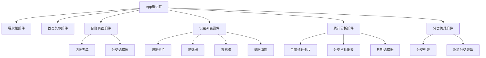
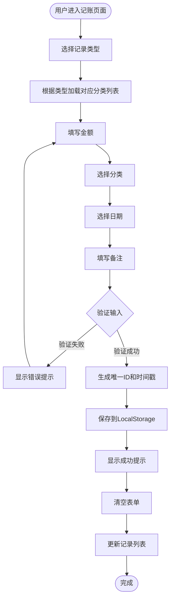
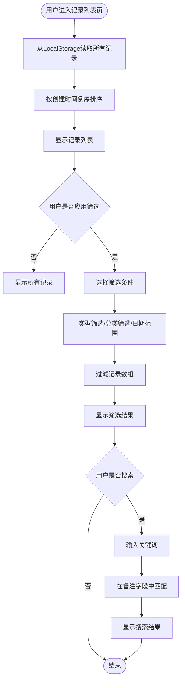
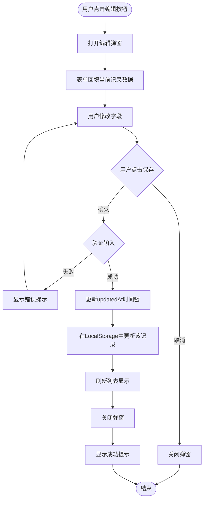
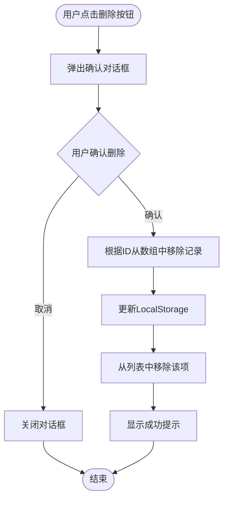

# 网页版记账本应用设计文档

## 项目概述

本项目旨在开发一个轻量级的网页版个人记账本应用,帮助用户记录和管理日常收支情况。应用采用纯前端架构,数据存储在浏览器本地,无需后端服务器支持,可快速部署和使用。

### 核心价值
- 提供简洁直观的收支记录界面
- 支持收支分类管理,便于统计分析
- 数据本地存储,保护用户隐私
- 无需注册登录,开箱即用

### 目标用户
个人用户,用于管理日常生活开支和收入

## 功能需求

### 收支记录管理
- 添加收支记录
  - 记录类型:收入或支出
  - 金额:支持小数点后两位
  - 分类:预设常用分类(餐饮、交通、购物、娱乐、工资、奖金等)
  - 日期:默认当天,可选择历史日期
  - 备注:可选文字说明
- 查看收支列表
  - 按时间倒序展示所有记录
  - 显示记录的完整信息(类型、金额、分类、日期、备注)
  - 支持分页或滚动加载
- 编辑已有记录
  - 修改记录的任意字段
  - 保存修改后更新列表
- 删除记录
  - 删除前需要二次确认
  - 删除后立即从列表中移除

### 分类管理
- 预设支出分类
  - 餐饮、交通、购物、娱乐、医疗、教育、住房、通讯、其他
- 预设收入分类
  - 工资、奖金、投资收益、兼职收入、其他
- 支持自定义分类
  - 添加新分类
  - 编辑分类名称
  - 删除自定义分类(预设分类不可删除)

### 数据统计
- 首页总览
  - 显示本月总收入
  - 显示本月总支出
  - 显示本月结余(收入-支出)
- 按分类统计
  - 展示各分类的支出占比
  - 展示各分类的收入占比
- 时间范围筛选
  - 支持按月份查看统计数据
  - 支持自定义日期范围

### 数据筛选与查询
- 按类型筛选:仅显示收入或支出
- 按分类筛选:选择特定分类查看
- 按日期范围筛选:选择起止日期
- 按关键词搜索:在备注中搜索

## 系统架构

### 架构模式
采用单页应用(SPA)架构,所有功能在一个网页中通过组件切换实现

### 技术选型策略

| 技术层 | 选型 | 理由 |
|--------|------|------|
| 前端框架 | React | 组件化开发,生态丰富,易于维护 |
| UI组件库 | Ant Design 或 Material-UI | 提供完整的组件和设计规范,加速开发 |
| 状态管理 | React Context API | 轻量级应用,无需引入Redux等重型方案 |
| 数据存储 | LocalStorage | 浏览器原生支持,数据持久化在本地 |
| 路由管理 | React Router | 实现页面间导航 |
| 构建工具 | Vite 或 Create React App | 快速搭建开发环境 |

### 组件结构

## 数据模型

### 收支记录模型

| 字段名 | 数据类型 | 说明 | 约束 |
|--------|----------|------|------|
| id | 字符串 | 唯一标识符 | 必填,使用UUID或时间戳生成 |
| type | 字符串 | 记录类型 | 必填,枚举值:income(收入)或expense(支出) |
| amount | 数字 | 金额 | 必填,大于0,保留两位小数 |
| category | 字符串 | 分类名称 | 必填 |
| date | 字符串 | 日期 | 必填,格式:YYYY-MM-DD |
| note | 字符串 | 备注说明 | 可选,最大长度200字符 |
| createdAt | 字符串 | 创建时间 | 自动生成,ISO 8601格式 |
| updatedAt | 字符串 | 更新时间 | 自动生成,ISO 8601格式 |

### 分类模型

| 字段名 | 数据类型 | 说明 | 约束 |
|--------|----------|------|------|
| id | 字符串 | 唯一标识符 | 必填 |
| name | 字符串 | 分类名称 | 必填,最大长度20字符 |
| type | 字符串 | 所属类型 | 必填,枚举值:income或expense |
| isDefault | 布尔值 | 是否为预设分类 | 必填,预设分类不可删除 |
| createdAt | 字符串 | 创建时间 | 自动生成 |

### 数据存储结构

LocalStorage中存储两个主要键值对:

| 键名 | 值类型 | 说明 |
|------|--------|------|
| expense_records | JSON数组 | 存储所有收支记录 |
| expense_categories | JSON数组 | 存储所有分类信息 |

## 用户交互流程

### 添加收支记录流程

### 查看和筛选记录流程

### 编辑记录流程

### 删除记录流程

## 页面布局设计

### 整体布局结构

采用经典的顶部导航+内容区布局

- 顶部导航栏:固定在页面顶部,包含应用标题和主要导航菜单
- 内容区:根据当前路由显示不同页面组件
- 底部可选:显示版本信息或版权声明

### 页面列表

| 页面名称 | 路由路径 | 主要内容 |
|----------|----------|----------|
| 首页总览 | / | 本月收支统计卡片、快速记账入口 |
| 记账页面 | /add | 记账表单 |
| 记录列表 | /records | 记录列表、筛选器、搜索框 |
| 统计分析 | /statistics | 月度统计、分类占比图表 |
| 分类管理 | /categories | 分类列表、添加/编辑分类功能 |

### 首页总览布局

- 顶部:欢迎信息和当前月份
- 中部:三个统计卡片(本月收入、本月支出、本月结余)
- 底部:快速记账按钮,点击跳转到记账页面

### 记账页面布局

- 表单居中显示
- 字段从上到下依次排列:类型选择、金额输入、分类选择、日期选择、备注输入
- 底部两个按钮:提交和重置

### 记录列表页面布局

- 顶部:筛选器和搜索框
- 中部:记录卡片列表,每个卡片显示一条记录的完整信息
- 卡片右侧:编辑和删除按钮

### 统计分析页面布局

- 顶部:日期范围选择器
- 上部:月度统计数据(收入、支出、结余)
- 中部:支出分类占比饼图
- 下部:收入分类占比饼图

### 分类管理页面布局

- 左侧:支出分类列表
- 右侧:收入分类列表
- 每个列表底部:添加新分类按钮
- 自定义分类旁边显示编辑和删除按钮

## 数据操作逻辑

### LocalStorage操作封装

为了统一管理LocalStorage操作,需要封装专门的数据访问层

功能包括:
- 初始化默认分类数据(首次使用时)
- 读取所有记录
- 添加新记录
- 更新指定记录
- 删除指定记录
- 读取所有分类
- 添加新分类
- 更新分类
- 删除分类
- 数据导出为JSON
- 从JSON导入数据

### 数据验证规则

**收支记录验证**:
- 金额必须大于0
- 金额最多保留两位小数
- 日期不能晚于当前日期
- 分类必须在已有分类列表中
- 备注长度不超过200字符

**分类验证**:
- 分类名称不能为空
- 分类名称长度不超过20字符
- 同一类型下分类名称不能重复
- 预设分类不能被删除或重命名

### 数据计算逻辑

**月度统计计算**:
- 筛选出指定月份的所有记录
- 分别累加收入类型和支出类型的金额
- 计算结余 = 总收入 - 总支出

**分类占比计算**:
- 筛选指定类型(收入或支出)的记录
- 按分类分组累加金额
- 计算每个分类占总额的百分比
- 按金额从大到小排序

**日期范围筛选**:
- 解析记录的日期字段
- 判断是否在指定的起止日期之间
- 返回符合条件的记录数组

## 性能优化策略

### 数据加载优化
- 应用启动时一次性读取LocalStorage数据到内存
- 避免频繁读取LocalStorage,优先从内存状态中获取数据
- 仅在数据变更时写入LocalStorage

### 列表渲染优化
- 当记录数量较多时(超过100条),实现虚拟滚动或分页加载
- 避免一次性渲染所有记录导致页面卡顿

### 图表渲染优化
- 使用轻量级图表库(如Chart.js或Recharts)
- 仅在统计页面可见时渲染图表
- 缓存已计算的统计数据,避免重复计算

## 用户体验设计

### 操作反馈
- 所有提交操作成功后显示成功提示(Toast或Notification)
- 操作失败时显示明确的错误信息
- 删除等危险操作需要二次确认

### 表单设计
- 日期选择器默认显示今天
- 金额输入框自动聚焦
- 输入框失焦时自动验证
- 表单验证失败时在字段下方显示错误提示

### 响应式设计
- 支持桌面端和移动端浏览器
- 移动端优化触摸操作体验
- 小屏幕下适当调整布局和字体大小

### 空状态处理
- 首次使用时显示欢迎信息和使用引导
- 记录列表为空时显示友好提示和快速添加按钮
- 筛选无结果时显示提示信息

## 数据安全与隐私

### 数据存储安全
- 数据存储在用户浏览器本地,不上传到服务器
- 提醒用户定期导出数据备份,防止浏览器数据清除导致丢失

### 数据导入导出
- 提供数据导出功能,生成JSON文件下载
- 提供数据导入功能,支持上传之前导出的JSON文件
- 导入时验证数据格式的合法性

### 浏览器兼容性
- 检测浏览器是否支持LocalStorage
- 不支持时显示友好提示,建议更换现代浏览器

## 错误处理机制

### LocalStorage错误处理
- 容量超限:提示用户数据已满,建议删除旧记录或导出数据
- 读取失败:显示错误信息,尝试恢复或重新初始化
- 写入失败:提示用户操作未保存,建议重试

### 数据格式错误处理
- 读取的数据格式不正确时,尝试修复或初始化为默认数据
- 记录所有数据错误日志,便于排查问题

### 用户操作错误处理
- 输入验证失败时,明确告知用户哪个字段有问题
- 网络图片加载失败时显示占位图
- 页面路由不存在时重定向到首页

## 后续扩展方向

### 功能扩展
- 预算管理:设置月度预算,超支时提醒
- 账单提醒:定期账单录入和到期提醒
- 多账户支持:管理多个账户(现金、银行卡、信用卡等)
- 数据可视化:增加趋势图、对比分析等高级图表
- 标签功能:为记录添加自定义标签,支持多标签筛选

### 技术扩展
- 添加后端服务:支持数据云端同步
- 用户系统:支持多用户注册登录
- 移动端App:开发原生移动应用
- 数据加密:对敏感数据进行加密存储
- PWA支持:实现离线访问和桌面安装

## 开发计划

### 开发阶段划分

| 阶段 | 主要任务 | 预期产出 |
|------|----------|----------|
| 第一阶段 | 项目初始化、基础组件开发 | 完成项目搭建和通用组件 |
| 第二阶段 | 核心功能开发 | 实现记账、列表、筛选功能 |
| 第三阶段 | 统计分析功能 | 实现数据统计和图表展示 |
| 第四阶段 | 分类管理和优化 | 实现分类管理和性能优化 |
| 第五阶段 | 测试和发布 | 完成测试并部署上线 |

### 质量保障
- 单元测试:关键数据处理函数编写单元测试
- 集成测试:测试完整的用户操作流程
- 浏览器兼容性测试:在主流浏览器中测试
- 性能测试:测试大数据量下的应用表现
